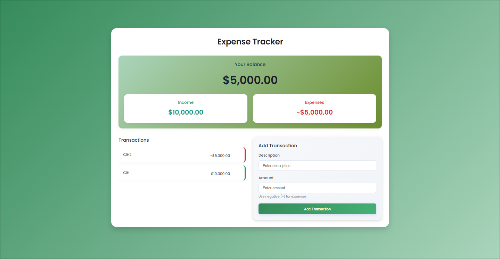

# 💸 Expense-Tracker

A simple, elegant web application to **track your income and expenses** with real-time balance updates, visual transaction list, and a clean UI.

## 🔍 Preview




---


## 🔗 Live Demo

👉 [Click here to view the live app](https://abdarrhmanessetaoui.github.io/Expense-Tracker/)

---

## 🚀 Features

- Add income and expenses
- Delete transactions
- Live balance updates
- Animated transaction list
- Responsive design
- Smooth UI with CSS animations

---

## 🛠️ Technologies Used

- HTML5  
- CSS3 (Flexbox, Grid, Responsive Design)  
- JavaScript (Vanilla)

---

## 📁 Project Structure

```bash
Expense-Tracker/
├── index.html
├── style.css
├── script.js
└── README.md


